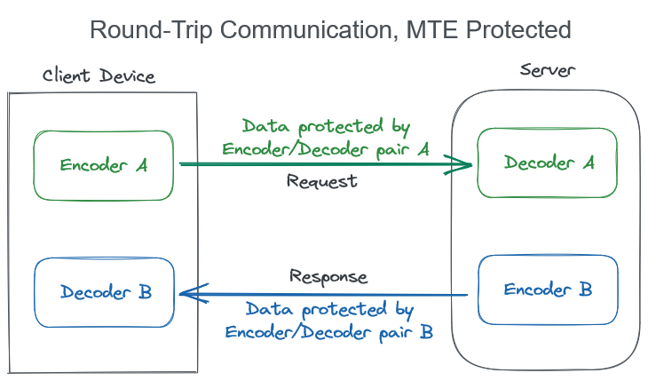
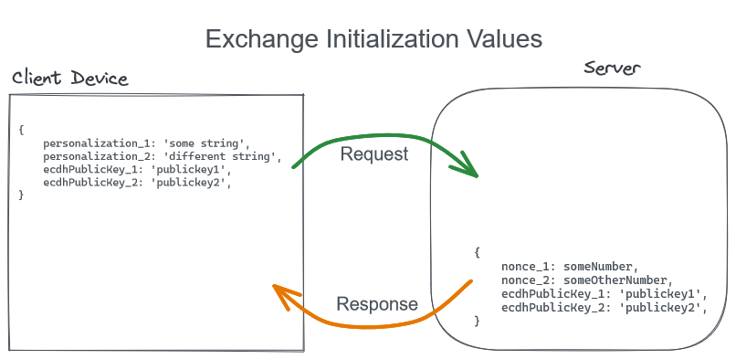

# Client and Server MTE Pairing Guide

This guide details the recommended steps for pairing encoders and decoders on the client with their counterparts on the server. The process can be described in three stages:

1. Creating Initialization values
   - ECDH is used to create an entropy value
2. Exchanging values between the client and server
3. Creating encoder/decoder pairs

## Introduction

To create an encoder/decoder pairing, we need to generate matching initialization values on the client and the server. Additionally, since encoder/decoder pairs are one-directional, we need to create two pairs of encoders/decoder, in order to facilitate request and response pathways.

<br/>
<center>
  
</center>
<br/>

## 1. Create initialization Values

On the client, create two personalization strings, and two ECDH key pairs. On the server, create two nonce values and two ECDH key pairs. Finally, exchange all values in a single API request/response.

Below are two functions you can use to create a GUID for personalization strings and a random number for a nonce. However, you can create Personalization Strings and Nonces however you like.

```js
/**
 * Use Javascript to create a v4 uuid.
 * https://stackoverflow.com/a/2117523/4927236
 */
function uuidv4() {
  return ([1e7] + -1e3 + -4e3 + -8e3 + -1e11).replace(/[018]/g, (c) =>
    (
      c ^
      (crypto.getRandomValues(new Uint8Array(1))[0] & (15 >> (c / 4)))
    ).toString(16)
  );
}

/**
 * Generate a random number
 */
function makeNonce() {
  return Math.floor(Math.random() * 1e15).toString();
}
```

To create entropy using ECDH, please consult the [Elliptical-Curve Diffie-Helman (ECDH) guide](./ecdh-entropy-guide.md).

## 2. Exchange Initialization Values

Simply exchange initialization values via API request. Create an API route `/mte-pair` that will handle the exchange of init values.

<br/>
<center>
  
</center>
<br/>

Be sure to use the foreign public keys to complete the ECDH process and create matching entropy values on both the client and the server.

## 3. Create Encoders and Decoders

Use the initialization values to create encoders and decoders:

```js
import { createMteEncoder, createMteDecoder } from "mte-helpers";

// three initialization values
const initValues = {
  personalization: "83809bcf-f5fb-4a8f-919f-f572d413bf7c",
  nonce: "558042555544002",
  entropy: {
    encoding: "plaintext",
    value: "E2pMm4TagMRWd3Af6rnEXH9kFYlbsVqD",
  },
};

// create an encoder, assign it a unique id
await createMteEncoder({
  id: "encoder_001",
  ...initValues,
});

// create a decoder, with matching values and it's own unique id
await createMteDecoder({
  id: "decoder_001",
  ...initValues,
});
```

You can now MTE encode data on the client, send it to the server, and decode it there. Similarly, you can encode server responses, and decode them on the client!
