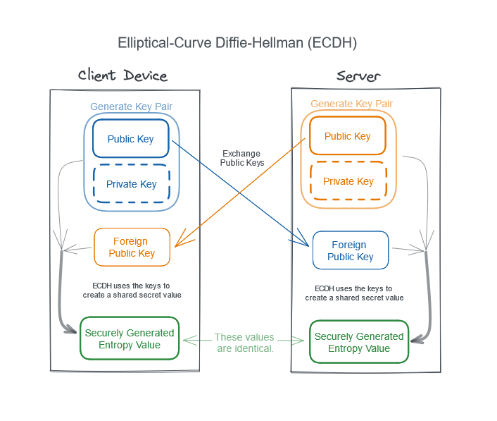

# Creating Secure Entropy using ECDH

While it's possible to generate entropy many different ways, Elliptical Curve Diffie-Hellman (ECDH) key exchange is the recommended method of generating secure entropy.

## Introduction

ECDH entropy should be considered in a few steps:

1. Both parties generate a pair of public and private keys.
2. Both parties exchange public keys.
3. Both parties use their own keys PLUS the other party's public to generate a new value; our entropy value!

<br/>
<center>
  
</center>
<br/>

Below are code examples that show how to use ECDH with Javascript in a browser, and in a Node environment.

### Browser ECDH Example

The code snippet below generates an ECDH public key as a base64 encoded string, as well as a function for consuming a foreign public key (also as a base64 encoded string). It is up to the application developer to facilitate the transfer of the public keys to their consumer.

> Note: This example creates and uses ECDH keys in ["Raw" format](https://developer.mozilla.org/en-US/docs/Web/API/SubtleCrypto/importKey#supported_formats).

````js
/**
 * Elliptical Curve Diffie Helman options to use.
 * https://developer.mozilla.org/en-US/docs/Web/API/SubtleCrypto/deriveKey#supported_algorithms
 */
const algorithm = {
  name: "ECDH",
  namedCurve: "P-256",
};

/**
 * Generates ECDH keys, and returns a base64 representation of the public key,
 * as well as a closure function that can consume a foreign public key and generate a shared secret.
 * @returns An object with a public key and a function for generating a shared secret.
 *
 * Example:
 * ```js
 * const ecdh = await getEcdh();
 * console.log(ecdh.publicKey);
 * const secret = await ecdh.computeSharedSecret(foreignKey);
 * ```
 */
const getEcdh = async function () {
  const keys = await window.crypto.subtle.generateKey(algorithm, false, [
    "deriveBits",
    "deriveKey",
  ]);

  const publicKey = await window.crypto.subtle.exportKey("raw", keys.publicKey);
  const publicKeyBase64 = arrayBufferToBase64(publicKey);

  /**
   * Take in a foreign public key as a base64 string, and return a shared secret as an array buffer.
   * @param foreignPublicKey A base64 encoded foreign public key.
   * @returns A Uint8Array array buffer with the shared secret.
   */
  async function computeSharedSecret(foreignPublicKey) {
    const foreignKeyBuffer = base64ToArrayBuffer(foreignPublicKey);
    const importedPublicKey = await window.crypto.subtle.importKey(
      "raw",
      foreignKeyBuffer,
      algorithm,
      true,
      []
    );
    const secret = await window.crypto.subtle.deriveBits(
      { name: "ECDH", public: importedPublicKey },
      keys.privateKey,
      256
    );
    const result = new Uint8Array(secret);
    return result;
  }

  return {
    publicKey: publicKeyBase64,
    computeSharedSecret,
  };
};

/**
 * Utility to convert a array buffer to a base64 string.
 * @param buffer A typed array.
 * @returns A base64 encoded string of the original array buffer data.
 */
function arrayBufferToBase64(buffer) {
  return btoa(String.fromCharCode.apply(null, new Uint8Array(buffer)));
}

/**
 * Utility to convert a base64 string into an array buffer.
 * @param base64Str A base64 encoded string.
 * @returns An array buffer.
 */
function base64ToArrayBuffer(base64Str) {
  const str = window.atob(base64Str);
  let i = 0;
  const iMax = str.length;
  const bytes = new Uint8Array(iMax);
  for (; i < iMax; ++i) {
    bytes[i] = str.charCodeAt(i);
  }
  return bytes.buffer;
}
````

### NodeJS ECDH Example

The code snippet below generates an ECDH public key as a base64 encoded string, as well as a function for consuming a foreign public key (also as a base64 encoded string). It is up to the application developer to facilitate the transfer of the public keys to their consumer.

````js
const crypto = require("crypto");

/**
 * Generates ECDH keys, and returns a base64 representation of the public key, as well
 * as a closure function that can consume a foreign public key and generate a shared secret.
 * @returns An object with a public key and a function for generating a shared secret.
 *
 * Example:
 * ```js
 * const ecdh = await getEcdh();
 * console.log(ecdh.publicKey);
 * const secret = await ecdh.computeSharedSecret(foreignKey);
 * ```
 *
 * [NodeJS ECDH Docs](https://nodejs.org/api/crypto.html#class-ecdh)
 */
function getEcdh() {
  const ecdh = crypto.createECDH("prime256v1");
  ecdh.generateKeys();
  const publicKeyBase64 = ecdh.getPublicKey("base64");

  function computeSharedSecret(foreignPublicKeyBase64) {
    const secret = ecdh.computeSecret(foreignPublicKeyBase64, "base64");
    return new Uint8Array(secret);
  }

  return {
    publicKey: publicKeyBase64,
    computeSharedSecret,
  };
}

module.exports = {
  getEcdh,
};
````
