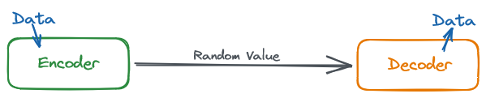

# MTE Quick Start Guide

## Introduction

MTE is a cutting-edge, patented, and licensed technology that encodes and encrypts data being transmitted between a sender and receiver. MTE works with any communication protocol, supports all major operating systems, and provides modules for interacting with MTE in the most common programming languages, allowing MTE to run almost anywhere.

The goal of this package is to make implementing MTE as easy as possible. It does this by reducing the API surface area to just five functions, and it takes complete control over MTE State management. For advanced use cases, consider using the MTE-Helpers "Core" package.

> Note: The MTE-Helpers package requires that a licensed version of the MTE library is supplied as a peer dependency in your project.

## Installation

Your company's licensed MTE library should be delivered to you as a .tgz file and you can install it into your project with this command:\
`npm i file:[FILE_NAME_HERE].tgz`

Then, install the MTE Helpers package:\
`npm i mte-helpers`

## Initialization

MTE uses a Web Assembly (WASM) module to execute encode and decode operations. You must instantiate the MTE WASM module exactly once, and we recommend doing it as early as possible in your application.

```js
import { instantiateMteWasm } from "mte-helpers";

// Initialize MTE WASM module with credentials
await instantiateMteWasm({
  licenseCompany: "COMPANY_NAME_HERE",
  licenseKey: "LICENSE_KEY_HERE",
});
```

[Read the API Reference](./api-reference/managed.md)

## Encoders and Decoders

To use MTE, create an MTE Encoder and an MTE Decoder using the same initialization values. This encoder is now considered "paired" to exactly this one specific decoder. Any data that is encoded by the encoder can be decoded by only this specific decoder, and no one else.

<br/>
<center>
  
</center>
<br/>

### Initialization Values

To create an encoder or decoder, you must provide three initialization values, and a unique ID. To create an encoder/decoder pair, the initialization values must match.

1. **Personalization String**
   - A string that is unique to this encoder/decoder relationship. This can be a GUID, an email address, user ID, or any string the is typically unique.
2. **Nonce**
   - A string of integers. Example: `"1238976123876123"`
3. **Entropy**
   - A random value. More randomness results in better security.
4. **ID**
   - A unique identifier that is assigned to the encoder or decoder. The ID should be absolutely unique; it should not match any other encoder or decoder.

```js
import { createMteEncoder, createMteDecoder } from "mte-helpers";

// three initialization values
const initValues = {
  personalization: "83809bcf-f5fb-4a8f-919f-f572d413bf7c",
  nonce: "558042555544002",
  entropy: {
    encoding: "plaintext",
    value: "E2pMm4TagMRWd3Af6rnEXH9kFYlbsVqD",
  },
};

// create an encoder with a unique id
await createMteEncoder({
  id: "encoder_001",
  ...initValues,
});

// create a decoder, with matching values and it's own unique id
await createMteDecoder({
  id: "decoder_001",
  ...initValues,
});
```

[Read the API Reference](./api-reference/managed.md)

TODO: Create guide on creating initialization values and exchanging them between a client and server.

## Encoding Data

MTE can encode strings, like JSON, or binary data from a Uint8Array, which might represent a file or a chunk of a file. To encode data, call the encode function and pass in the data to encode, as well as the ID of the encoder to use.

```js
import { mteEncode } from "mte-helpers";

// encode data
const encoded = await mteEncode("P@ssw0rd!", { id: "encoder_001" });
```

[Read the API Reference](./api-reference/managed.md)

## Decoding Data

To decode data, call the decode function and pass in the data to decode, as well as the ID of the decoder to use. A decode will only be successful if

- The decoded data comes from a paired encoder.
- The decoder type matches the encoder type: MTE or MKE.
  - MTE Decoders can decode data that was Fixed-Length (FLEN) encoded.

```js
import { mteDecode } from "mte-helpers";

// decode data
const decoded = await mteDecode(encodedData, { id: "decoder_001" });
```

[Read the API Reference](./api-reference/managed.md)

## MTE State

MTE encoders and decoders maintain an internal state that is changed each time they're used. The state can be exported and saved, then used at a later time to create a new encoder or decoder with the same state. This is a key concept that allows an application to create and use an encoder/decoder only when needed, and then save their state and destroy the objects, conserving memory while the encoder/decoders are not in use.

The MTE-Helpers package manages state and the creation and destruction of encoders automatically, using an in-memory data store. However, you may choose to use another storage solution, such as Redis or Memcached. To do so, implement asynchronous getter and setter functions in the MTE initialization options.

### `saveState(id: any, value: string|Uint8Array): Promise<void>`

A setter function that uses the unique ID of an encoder or decoder to store the value, or MTE state, in a cache.

```js
async function customSaveState(id, value) {
  return redisClient.set(id, value);
}
```

### `takeState(id: any): Promise<string|Uint8Array>`

A getter function that uses the unique ID of an encoder or decoder to take MTE state from cache. Importantly, you must remove MTE state from the cache, so that another process can not access State that is already in use.

```js
async function customTakeState(id) {
  const value = await redisClient.get(id);
  await redisClient.delete(id);
  return value;
}
```

Finally, pass your custom getter and setter functions into the initialization options.

```js
import { instantiateMteWasm } from "mte-helpers";

// Initialize MTE WASM module with credentials
await instantiateMteWasm({
  licenseCompany: "Example Co, LLC",
  licenseKey: "zrtuG0j9mJ27j7BG",
  saveState: customSaveState,
  takeState: customTakeState,
});
```

[Read the API Reference](./api-reference/managed.md)
